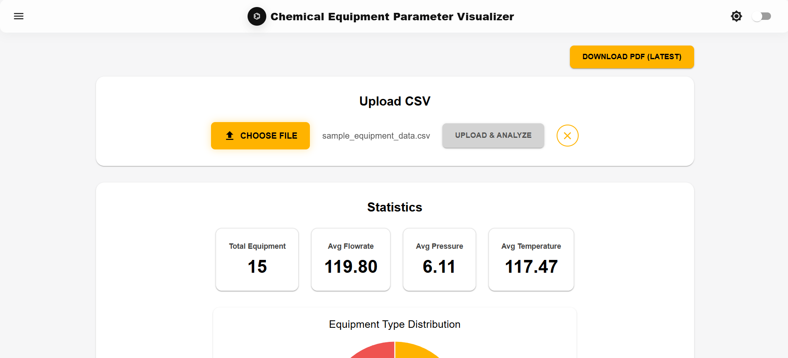
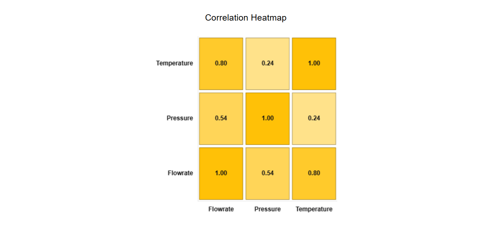
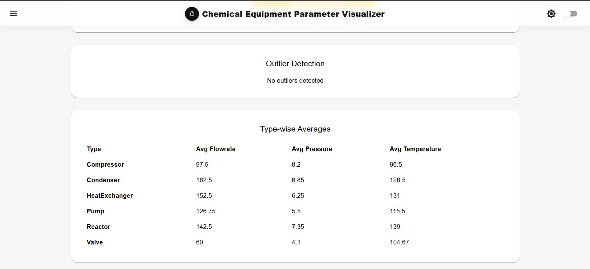
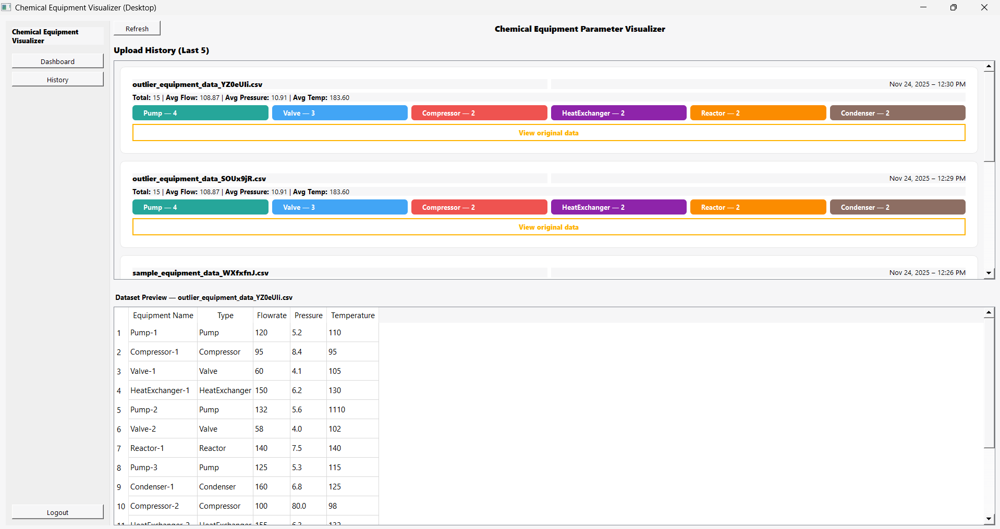
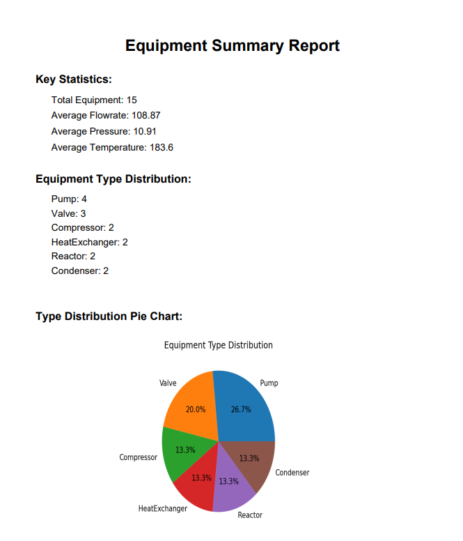

# Chemical-Equipment-Parameter-Visualizer

This project is a hybrid application consisting of these components:

      Django backend (REST API and data processing)
      React frontend 
      PyQt5 desktop application 
      MaterialUI, SQLite, ChartJS

The system allows users to upload CSV files containing equipment parameters such as flowrate, pressure, temperature, and type. The application processes the dataset and provides graphical and tabular visualizations.

Backend Setup:

1) Create and activate a virtual environment:
   Windows: python -m venv venv
            .\venv\Scripts\activate
   MacOS/Linux: python3 -m venv venv
                source venv/bin/activate
2) Navigate to the backend directory: cd backend
3) install backend dependencies: pip install -r requirements.txt
4) Apply migrations: python manage.py migrate
5) Start the development server: python manage.py runserver

Frontend React Setup:

1) Go to react directory: cd frontend-react
2) Install dependencies: npm install
3) Start development server: npm run dev

Desktop PyQt5 setup:

1) Go to the desktop folder: cd pyqt-desktop
2) Create a virtual environment:
            python -m venv venv
            .\venv\Scripts\activate   (Windows)
            source venv/bin/activate  (Linux/macOS)
3)Install dependencies: pip install -r requirements.txt
4) Run the application: python main.py

Screenshots:

-> React:

-> PyQt5:

-> PDF files:

